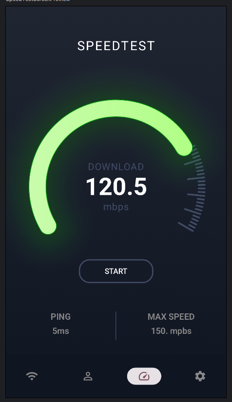

# SpeedTest

O **SpeedTest** é um aplicativo simples para medir a velocidade de download e upload da sua conexão de internet. Ele exibe os resultados em tempo real, com uma interface intuitiva e amigável.

## Funcionalidades

- Medição de velocidade de internet.
- Interface simples.
- Exibição de resultados de download e ping.
- Teste em tempo real.

## Imagens

## Como Usar

1. Abra o aplicativo.
2. Clique em "Iniciar Teste" para medir a velocidade.
3. Veja os resultados logo após o término do teste.
